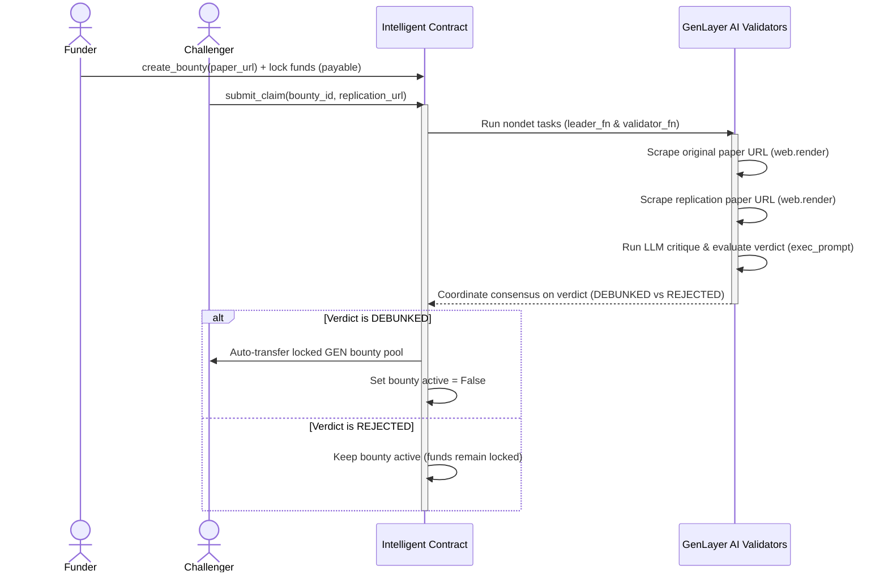

# DeSci Replicator - Decentralized Science Bounty for Debunking Flawed Research

DeSci Replicator is a Decentralized Science (DeSci) platform that financially incentivizes researchers to replicate, critique, and debunk flawed scientific papers. It uses GenLayer's AI Validators as an automated, consensus-driven "Scientific Review Board."

## The Pitch: Why DeSci Replicator DIES without GenLayer

In traditional blockchains (like Ethereum or Solana), creating a decentralized science bounty is **impossible** without heavy centralization. Here is why:
1. **No Native Web Access**: Smart contracts cannot read ArXiv papers, Medium articles, or public Notion pages to fetch the text of scientific studies. They are completely isolated from the web.
2. **No Qualitative Reasoning**: Standard smart contracts cannot read a research paper, understand its methodology, or evaluate whether a replication study successfully exposes a critical flaw or error in the original study. They are limited to simple arithmetic and cryptographic verifications.
3. **Oracle Vulnerability**: Attempting to resolve this via standard Web2 Oracles (like Chainlink) introduces extreme centralization. A single oracle reporter or a small multisig becomes the sole gatekeeper of truth, vulnerable to bribery, bias, and manipulation.

**GenLayer solves this completely:**
* **Native Non-Deterministic Web Scraping**: The contract uses `gl.nondet.web.render` to fetch clean text content from the original paper URL and the challenger's replication URL.
* **On-Chain AI Consensus**: GenLayer's AI Validators independently execute LLM prompts (via `gl.nondet.exec_prompt`) to analyze both texts, check the challenger's methodology, and coordinate on a binary consensus verdict (`DEBUNKED` vs `REJECTED`).
* **Auto-Execution**: If consensus is reached that the paper has been successfully debunked, the contract automatically releases the locked bounty funds to the researcher. No manual intervention, no centralized gatekeepers.

---

## Contract Details

* **Language**: Python (GenVM v0.2.16 Compatible)
* **Contract Address**: `0xA315505C469df0e8a53F38441Fc02909f2A08dF8`
* **RPC Endpoint**: `https://studio.genlayer.com/api`

---

## Core Workflow



---

## Local Setup & Development

### Prerequisites
* **Node.js**: v18 or later
* **npm**: v9 or later

### Installation

1. Navigate to the frontend folder:
   ```bash
   cd frontend
   ```

2. Install dependencies:
   ```bash
   npm install
   ```

3. Set up environment variables in `frontend/.env`:
   ```env
   VITE_CONTRACT_ADDRESS=0xA315505C469df0e8a53F38441Fc02909f2A08dF8
   VITE_RPC_URL=https://studio.genlayer.com/api
   ```

### Execution

To run the local development server:
```bash
npm run dev
```

To build the static application:
```bash
npm run build
```
